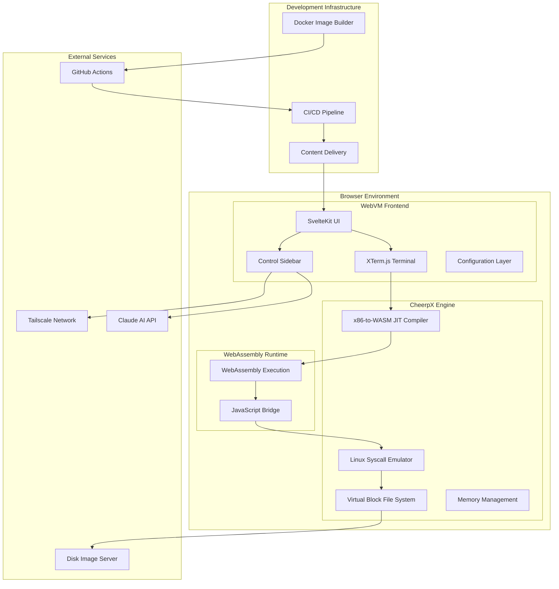
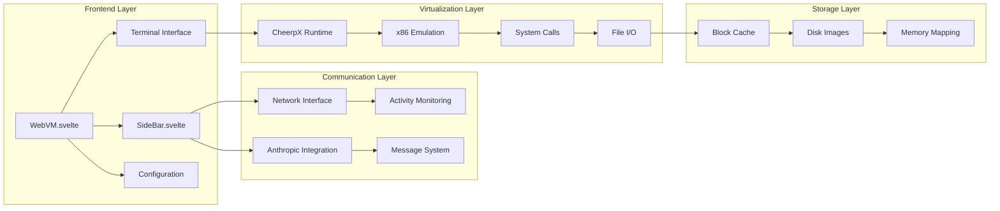
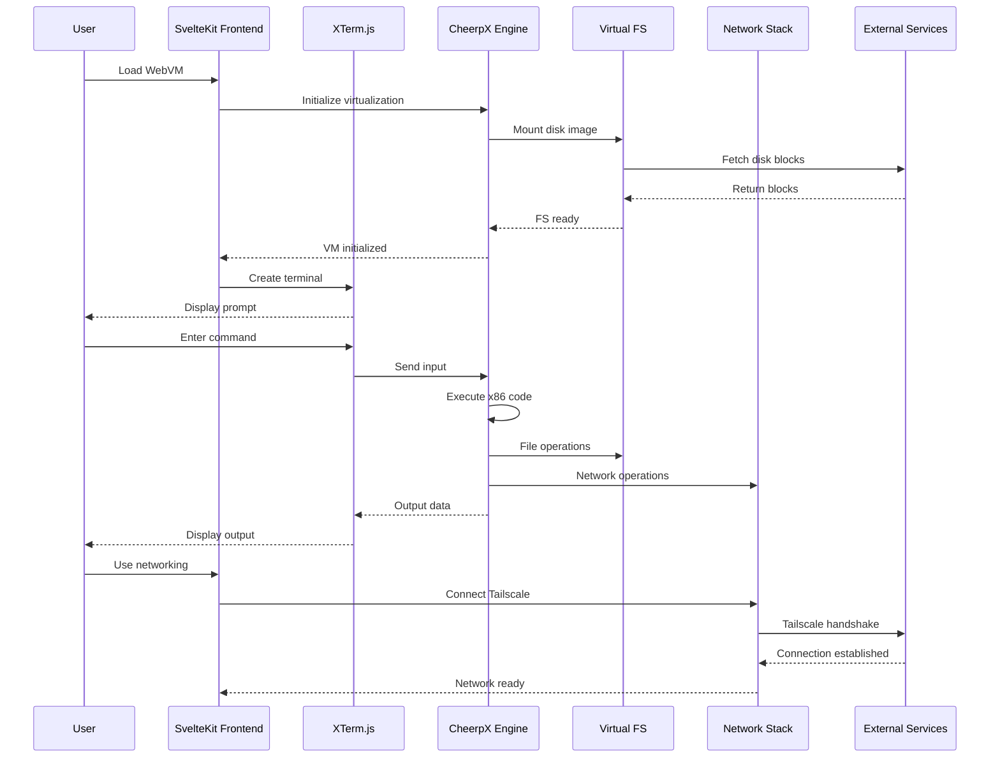
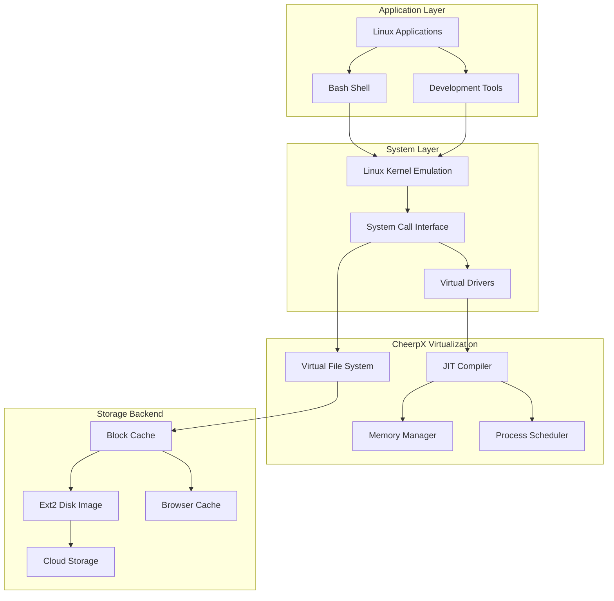
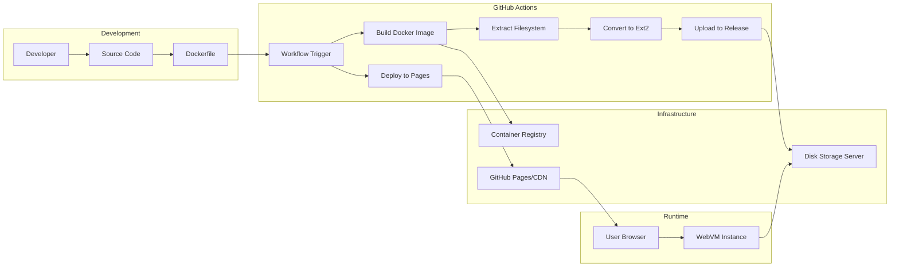
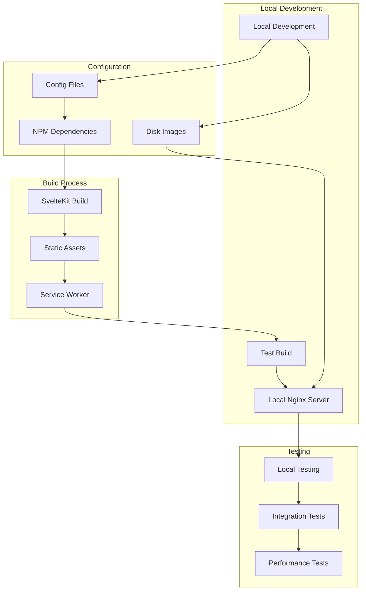
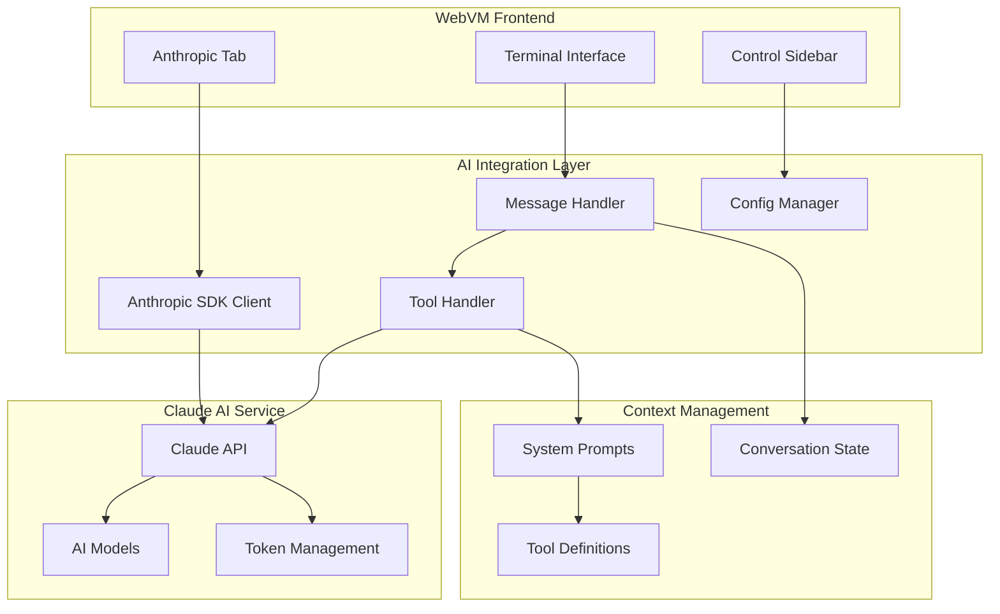
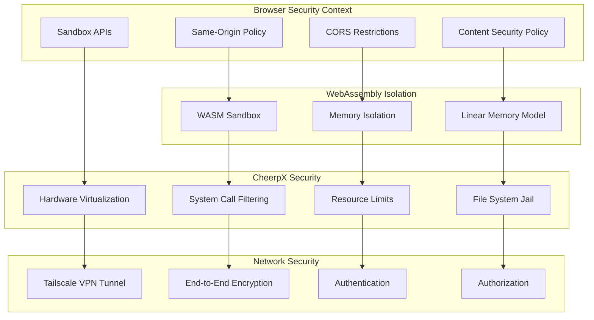

# WebVM Technical Architecture Documentation

## Overview

WebVM is a revolutionary browser-based Linux virtual machine that enables server-less x86 virtualization directly in web browsers. Built on the CheerpX virtualization engine, it provides full Linux ABI compatibility while running entirely client-side through HTML5/WebAssembly technology.

## High-Level System Architecture



## Core Components Architecture



## Data Flow and Communication



## Networking Architecture

```mermaid
graph TB
    subgraph "WebVM Instance"
        VM[Linux VM]
        NetStack[lwIP TCP/IP Stack]
        TailscaleClient[Tailscale Client]
    end
    
    subgraph "Browser"
        WebSocket[WebSocket Connection]
        NetworkTab[Network UI Panel]
    end
    
    subgraph "Tailscale Infrastructure"
        TailscaleAuth[Tailscale Auth Server]
        TailscaleRelay[Tailscale Relay (DERP)]
        TailscaleCoord[Coordination Server]
    end
    
    subgraph "Target Services"
        Internet[Internet Services]
        PrivateNet[Private Networks]
        P2P[Peer-to-Peer]
    end
    
    VM --> NetStack
    NetStack --> TailscaleClient
    TailscaleClient --> WebSocket
    WebSocket --> NetworkTab
    TailscaleClient --> TailscaleAuth
    TailscaleClient --> TailscaleCoord
    TailscaleClient --> TailscaleRelay
    TailscaleRelay --> Internet
    TailscaleRelay --> PrivateNet
    TailscaleCoord --> P2P
```

## File System and Virtualization Layers



## Deployment and CI/CD Pipeline



## Development Workflow



## AI Integration Architecture



## Security and Sandboxing Model



## Technology Stack

### Frontend Technologies
- **SvelteKit**: Modern web application framework
- **XTerm.js**: Terminal emulator for web browsers
- **Tailwind CSS**: Utility-first CSS framework
- **Vite**: Build tool and development server
- **PostCSS**: CSS post-processor with autoprefixer

### Virtualization & Runtime
- **CheerpX**: x86-to-WebAssembly virtualization engine
- **WebAssembly**: Low-level binary instruction format
- **lwIP**: Lightweight TCP/IP stack compiled to WebAssembly
- **Cheerp**: C++ to WebAssembly compiler toolchain

### Infrastructure & Services
- **GitHub Actions**: CI/CD automation platform  
- **GitHub Pages**: Static site hosting
- **Tailscale**: VPN networking solution with WebSocket support
- **Anthropic Claude**: AI assistant integration
- **Docker**: Container platform for disk image creation

### Development & Build Tools
- **Node.js**: JavaScript runtime for development
- **NPM**: Package manager for dependencies
- **Nginx**: Web server for local development
- **Git**: Version control system

## Performance Characteristics

### Startup Performance
- Initial page load: ~2-3 seconds
- VM initialization: ~5-10 seconds  
- Disk image loading: Variable based on image size and connection
- First command execution: ~1-2 seconds

### Runtime Performance
- x86 instruction execution: ~10-50x slower than native
- Memory access: Near-native WebAssembly performance
- File I/O: Dependent on block cache and network latency
- Network throughput: Limited by WebSocket and VPN overhead

### Resource Utilization
- Memory usage: 200MB-2GB depending on workload
- CPU utilization: Single-threaded WebAssembly execution
- Storage: Client-side caching of frequently accessed blocks
- Network: WebSocket connections for disk I/O and VPN

## Scalability and Limitations

### Current Limitations
- Single-threaded execution model
- No direct TCP/UDP socket access (requires Tailscale)
- Limited hardware device access
- Browser memory and storage constraints
- WebAssembly performance overhead

### Scaling Considerations
- Disk image size affects loading time
- Block cache size impacts performance vs memory usage
- Multiple WebVM instances share browser resources
- Network connectivity depends on Tailscale infrastructure

This architecture enables WebVM to provide a full Linux environment entirely within the browser while maintaining security, performance, and compatibility with existing Linux software.