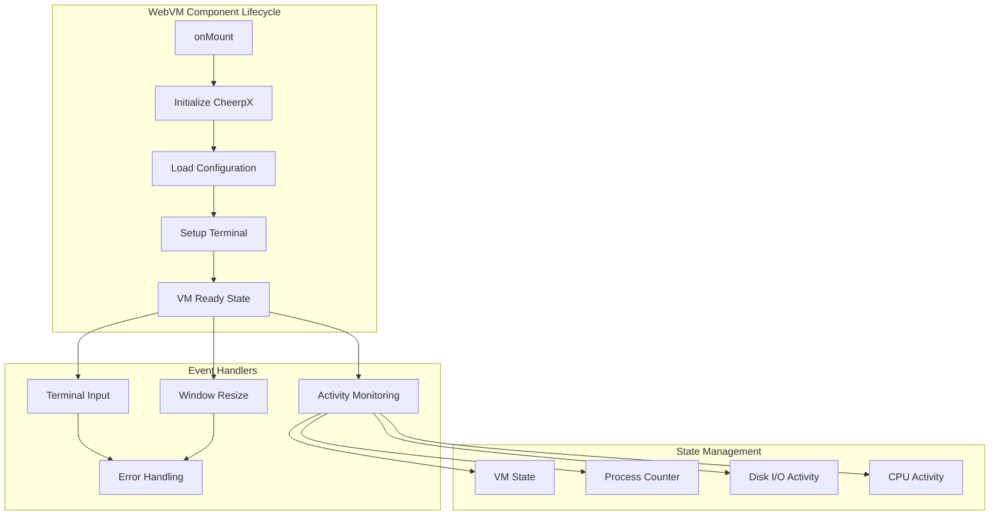
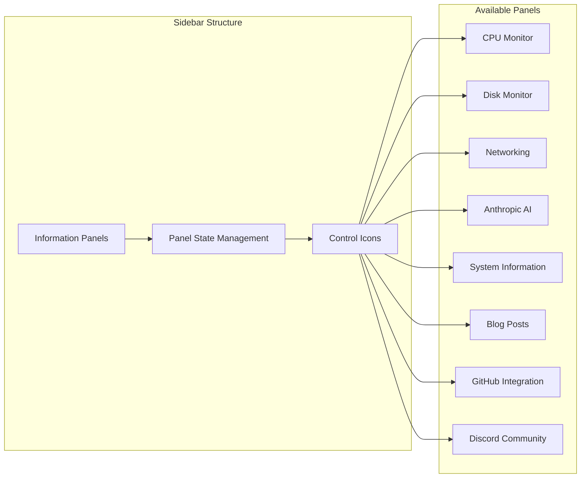
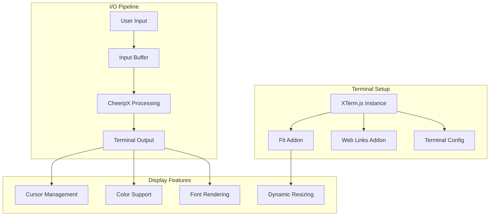
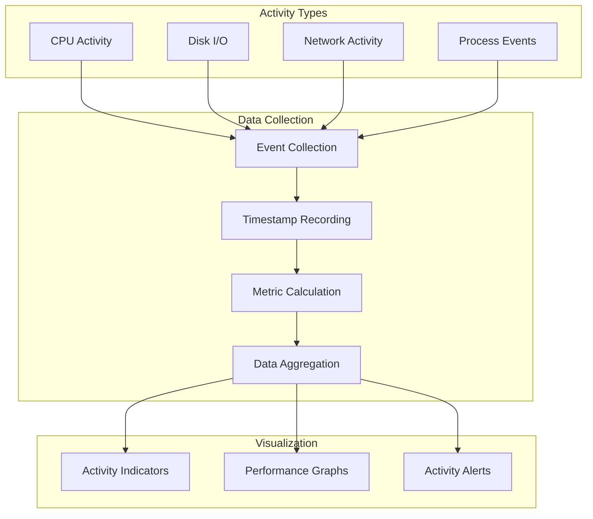
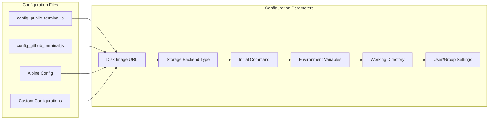
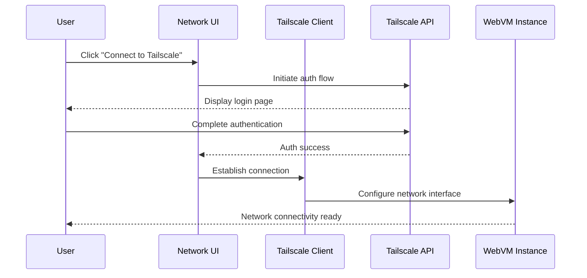
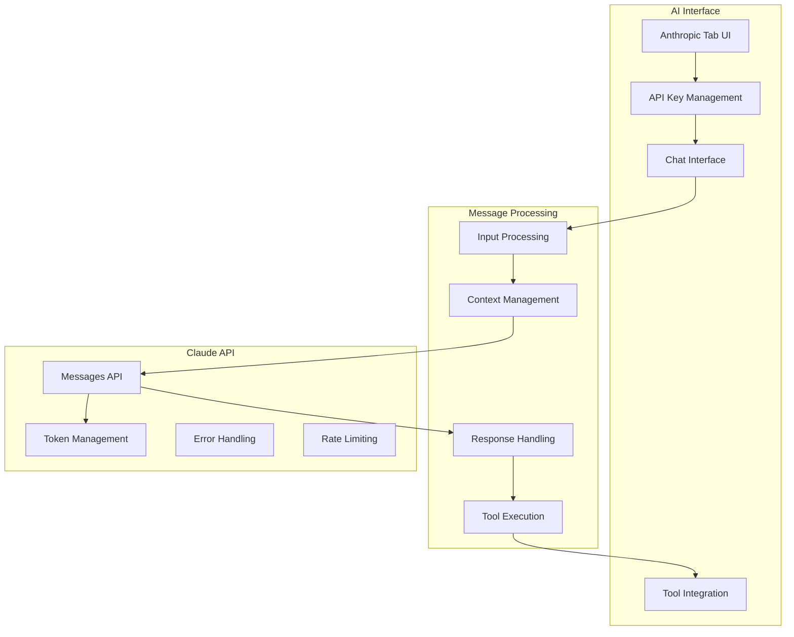
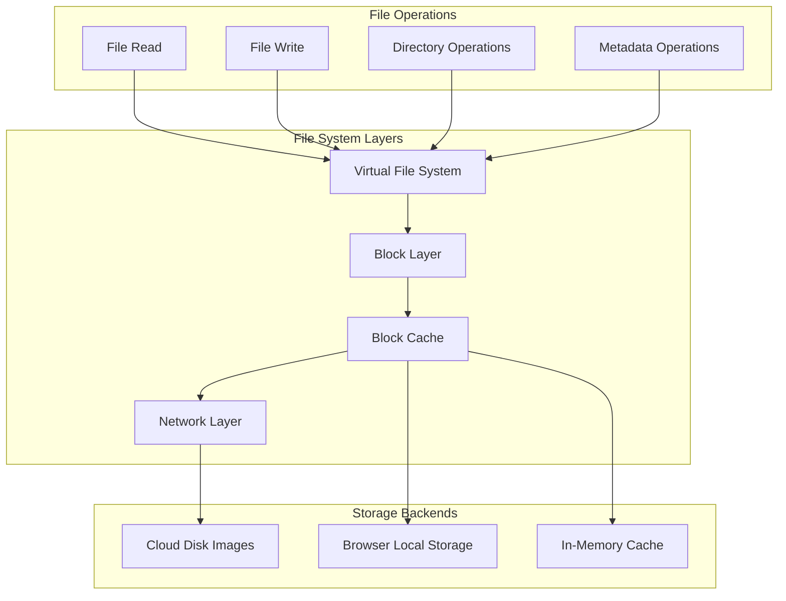
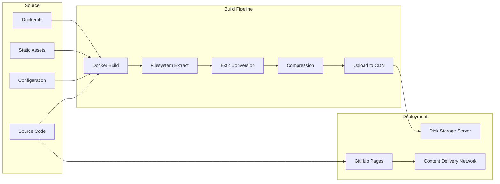
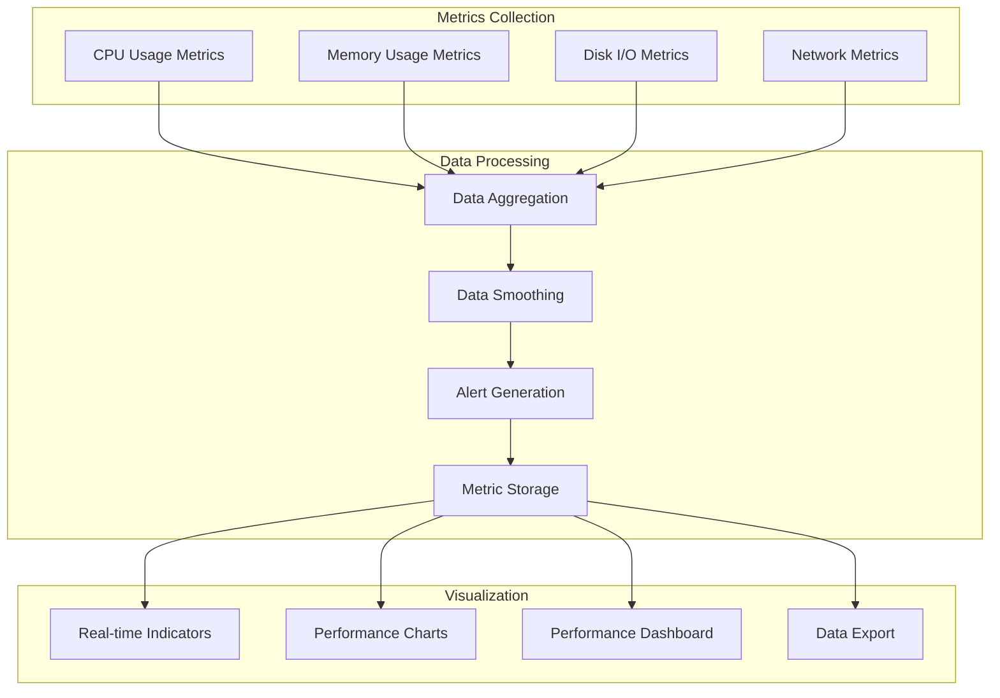

# WebVM Component Reference Documentation

This document provides detailed technical information about WebVM's key components and their interactions.

## Core Components

### WebVM.svelte - Main Application Component

The primary Svelte component that orchestrates the entire WebVM experience.



**Key Properties:**
- `configObj`: Configuration object for VM setup
- `processCallback`: Callback for process monitoring
- `cacheId`: Unique identifier for disk caching
- `cpuActivityEvents`: Array tracking CPU activity
- `diskLatencies`: Array tracking disk I/O performance

**Key Methods:**
- `writeData()`: Sends data to terminal
- `readData()`: Receives input from terminal  
- `printMessage()`: Displays system messages
- `registerActivity()`: Records system activity

### SideBar.svelte - Control Panel Interface

Provides the primary user interface for WebVM controls and information panels.



**Features:**
- Collapsible panel system
- Real-time activity indicators
- Mouse hover interactions
- Pin/unpin functionality for persistent display

### Terminal Integration (XTerm.js)

WebVM uses XTerm.js for terminal emulation with custom enhancements.



**Configuration Options:**
```javascript
const termConfig = {
    cursorBlink: true,
    convertEol: true,
    fontFamily: 'monospace',
    fontSize: 14,
    theme: {
        background: '#1a1a1a',
        foreground: '#ffffff'
    }
}
```

## Activity Monitoring System

WebVM includes comprehensive activity monitoring for system performance visualization.



**Activity Data Structure:**
```javascript
const activityEvent = {
    timestamp: Date.now(),
    type: 'cpu'|'disk'|'network'|'process',
    value: number,
    metadata: object
}
```

## Configuration System

WebVM supports multiple configuration profiles for different use cases.



**Configuration Example:**
```javascript
export const diskImageUrl = "wss://disks.webvm.io/debian_large.ext2";
export const diskImageType = "cloud";
export const cmd = "/bin/bash";
export const args = ["--login"];
export const opts = {
    env: ["HOME=/home/user", "TERM=xterm"],
    cwd: "/home/user",
    uid: 1000,
    gid: 1000
};
```

## Network Integration

WebVM's networking is built around Tailscale VPN integration for secure connectivity.



**Network Features:**
- WebSocket-based VPN connectivity
- Peer-to-peer networking when possible
- DERP relay fallback for NAT traversal
- End-to-end encryption
- DNS resolution through Tailscale

## AI Integration (Anthropic Claude)

WebVM includes integrated AI assistance through Anthropic's Claude API.



**AI Features:**
- Interactive chat interface
- Command execution assistance
- Code analysis and debugging
- System troubleshooting
- Educational explanations

## File System Architecture

WebVM implements a sophisticated virtual file system with cloud-based storage.



**File System Features:**
- Ext2 file system support
- Copy-on-write semantics
- Automatic block caching
- Lazy loading of disk blocks
- Persistent local caching

## Build System and Deployment

WebVM uses a sophisticated build pipeline for creating and deploying disk images.



**Build Process Features:**
- Automated Docker image building
- Filesystem extraction and conversion
- Optimized disk image compression
- Automated deployment to CDN
- Version management and rollback

## Performance Monitoring

WebVM includes comprehensive performance monitoring capabilities.



**Performance Features:**
- Real-time performance monitoring
- Historical performance data
- Performance alerts and notifications
- Exportable performance metrics
- Customizable monitoring dashboards

This component reference provides the technical foundation for understanding, extending, and maintaining WebVM's architecture.