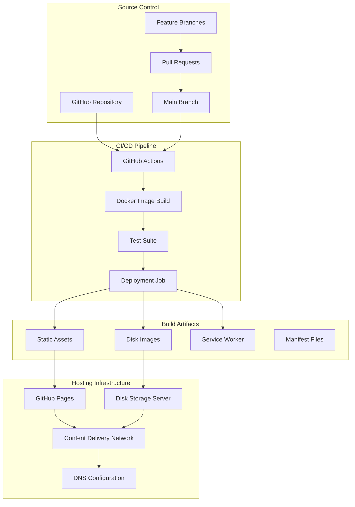
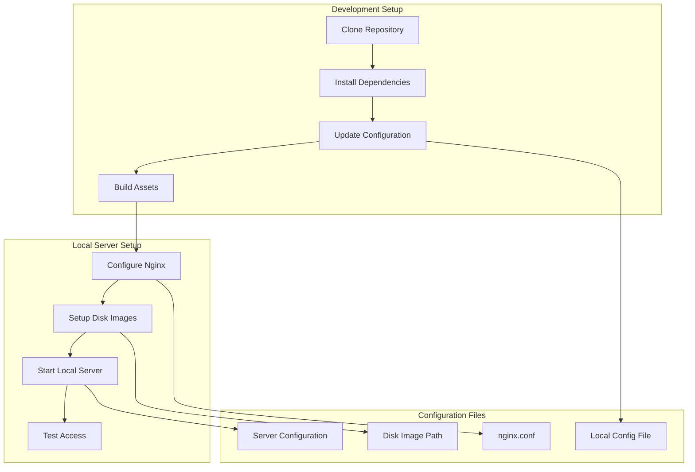
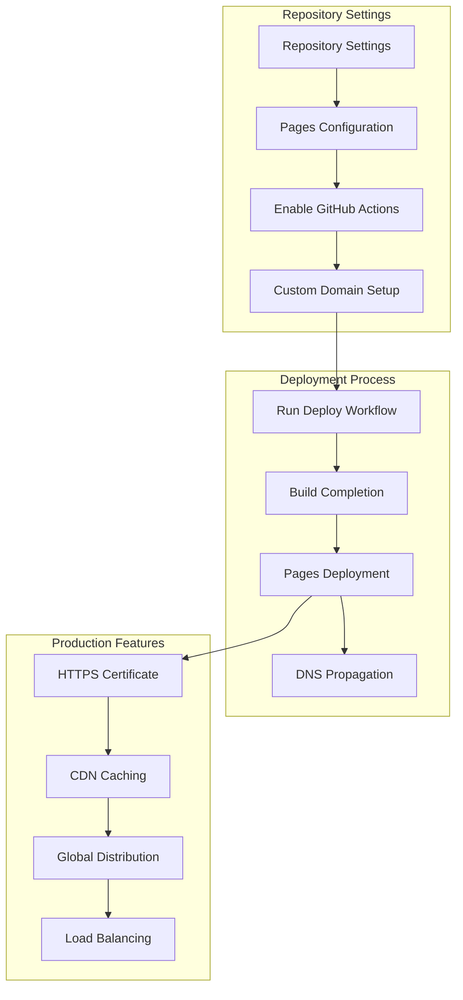
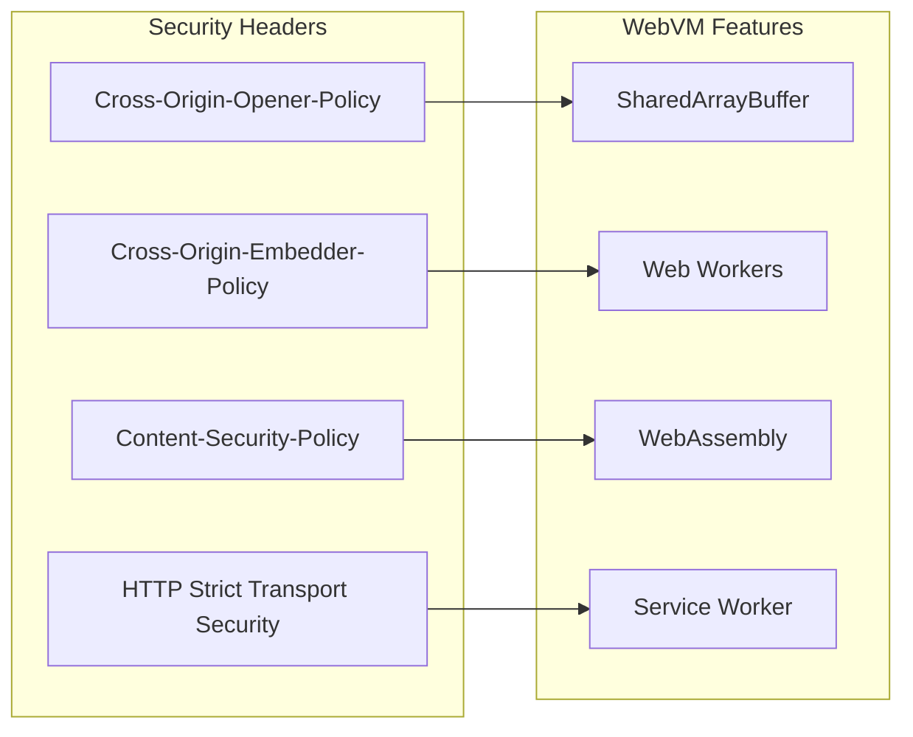
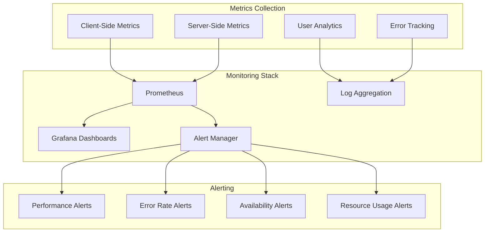

# WebVM Deployment Guide

This document provides comprehensive information about deploying WebVM in various environments and configurations.

## Deployment Architecture Overview



## GitHub Actions CI/CD Pipeline

WebVM uses GitHub Actions for automated building and deployment. The pipeline is defined in `.github/workflows/deploy.yml`.

### Workflow Stages

```mermaid
graph LR
    subgraph "Trigger Events"
        Push[Push to Main]
        Manual[Manual Trigger]
        Schedule[Scheduled Build]
    end
    
    subgraph "Build Stage"
        Checkout[Checkout Code]
        SetupNode[Setup Node.js]
        InstallDeps[Install Dependencies]
        BuildAssets[Build Static Assets]
    end
    
    subgraph "Docker Stage"
        DockerSetup[Setup Docker]
        BuildImage[Build Docker Image]
        ExtractFS[Extract Filesystem]
        ConvertExt2[Convert to Ext2]
        CompressImage[Compress Image]
    end
    
    subgraph "Deploy Stage"
        UploadArtifacts[Upload Artifacts]
        DeployPages[Deploy to Pages]
        UpdateDNS[Update DNS Records]
        NotifyComplete[Notify Completion]
    end
    
    Push --> Checkout
    Manual --> Checkout
    Schedule --> Checkout
    Checkout --> SetupNode
    SetupNode --> InstallDeps
    InstallDeps --> BuildAssets
    BuildAssets --> DockerSetup
    DockerSetup --> BuildImage
    BuildImage --> ExtractFS
    ExtractFS --> ConvertExt2
    ConvertExt2 --> CompressImage
    CompressImage --> UploadArtifacts
    UploadArtifacts --> DeployPages
    DeployPages --> UpdateDNS
    UpdateDNS --> NotifyComplete
```



### Workflow Configuration Parameters

The deployment workflow accepts several input parameters:

- **dockerfile_path**: Path to custom Dockerfile (default: `dockerfiles/debian_mini`)
- **build_context**: Docker build context directory (default: `dockerfiles`)
- **disk_size**: Virtual disk size in MB (default: `2048`)
- **github_token**: Authentication token for GitHub API
- **upload_to_release**: Whether to upload disk image to GitHub releases

### Key Workflow Steps

1. **Environment Setup**
   ```yaml
   - uses: actions/checkout@v4
   - uses: actions/setup-node@v4
     with:
       node-version: '18'
       cache: 'npm'
   ```

2. **Dependency Installation**
   ```yaml
   - run: npm ci
   - run: npm run build
   ```

3. **Docker Image Build**
   ```yaml
   - name: Build Docker Image
     run: |
       docker build -t webvm-build ${{ inputs.dockerfile_path }}
       docker create --name webvm-container webvm-build
   ```

4. **Filesystem Extraction**
   ```yaml
   - name: Extract Filesystem
     run: |
       docker export webvm-container | tar -xf -
       mke2fs -t ext2 -d . -F disk.ext2 ${{ inputs.disk_size }}M
   ```

5. **Deployment to GitHub Pages**
   ```yaml
   - uses: actions/deploy-pages@v4
     with:
       artifact_name: webvm-build
   ```

## Local Development Deployment

For local development and testing, WebVM can be deployed using a simple HTTP server with proper configuration.

### Prerequisites

```bash
# Install Node.js dependencies
npm install

# Download disk image for local testing
wget "https://github.com/leaningtech/webvm/releases/download/ext2_image/debian_mini_20230519_5022088024.ext2"
```

### Local Build Process



### Build Commands

```bash
# Build WebVM for local development
npm run build

# Create disk image directory
mkdir disk-images
mv debian_mini_20230519_5022088024.ext2 disk-images/

# Start local development server
nginx -p . -c nginx.conf
```

### Local Configuration Updates

Update `config_public_terminal.js` for local development:

```javascript
// Replace cloud disk URL with local path
export const diskImageUrl = "/disk-images/debian_mini_20230519_5022088024.ext2";
export const diskImageType = "bytes"; // Changed from "cloud"
```

## Production Deployment Strategies

### GitHub Pages Deployment

GitHub Pages is the recommended hosting platform for WebVM production deployments.



#### Setup Steps for GitHub Pages

1. **Fork the Repository**
   ```bash
   # Fork the WebVM repository to your GitHub account
   # Navigate to https://github.com/leaningtech/webvm
   # Click "Fork" button
   ```

2. **Enable GitHub Pages**
   - Go to repository Settings
   - Navigate to Pages section
   - Select "GitHub Actions" as source
   - Enable "Enforce HTTPS" if using custom domain

3. **Configure Custom Domain** (Optional)
   ```
   # Add CNAME file to repository root
   echo "your-domain.com" > CNAME
   
   # Configure DNS records
   # CNAME record: www.your-domain.com -> your-username.github.io
   # A records: your-domain.com -> GitHub Pages IPs
   ```

4. **Run Deployment Workflow**
   - Navigate to Actions tab
   - Select "Deploy" workflow
   - Click "Run workflow"
   - Monitor build progress

### Self-Hosted Deployment

For organizations requiring more control, WebVM can be deployed on self-hosted infrastructure.

```mermaid
graph TB
    subgraph "Infrastructure Components"
        WebServer[Web Server (Nginx/Apache)]
        DiskStorage[Disk Image Storage]
        CDN[CDN/Proxy Layer]
        Monitoring[Monitoring Stack]
    end
    
    subgraph "Security Layer"
        SSL[SSL/TLS Termination]
        WAF[Web Application Firewall]
        RateLimit[Rate Limiting]
        Auth[Authentication Layer]
    end
    
    subgraph "Scalability"
        LoadBalancer[Load Balancer]
        AutoScaling[Auto Scaling]
        HealthChecks[Health Checks]
        Backup[Backup Strategy]
    end
    
    WebServer --> SSL
    DiskStorage --> CDN
    CDN --> WAF
    WAF --> RateLimit
    RateLimit --> Auth
    LoadBalancer --> WebServer
    AutoScaling --> LoadBalancer
    HealthChecks --> AutoScaling
    Monitoring --> HealthChecks
    Backup --> DiskStorage
```

#### Self-Hosted Setup

1. **Server Requirements**
   - 2+ CPU cores
   - 4GB+ RAM
   - 100GB+ storage
   - HTTPS support
   - WebSocket support

2. **Web Server Configuration**
   ```nginx
   server {
       listen 443 ssl;
       server_name webvm.your-domain.com;
       
       ssl_certificate /path/to/cert.pem;
       ssl_certificate_key /path/to/key.pem;
       
       location / {
           root /var/www/webvm;
           try_files $uri $uri/ /index.html;
       }
       
       location /disk-images/ {
           root /var/www/webvm;
           expires 1y;
           add_header Cache-Control "public, immutable";
       }
       
       location ~* \.(wasm|ext2)$ {
           add_header Cross-Origin-Embedder-Policy require-corp;
           add_header Cross-Origin-Opener-Policy same-origin;
       }
   }
   ```

3. **Disk Image Hosting**
   ```bash
   # Setup disk image storage
   mkdir -p /var/www/webvm/disk-images
   
   # Copy disk images
   cp *.ext2 /var/www/webvm/disk-images/
   
   # Set proper permissions
   chown -R www-data:www-data /var/www/webvm
   chmod -R 644 /var/www/webvm/disk-images
   ```

## Container Deployment

WebVM can be containerized for deployment in container orchestration platforms.

### Docker Deployment

```dockerfile
# Dockerfile for WebVM deployment
FROM nginx:alpine

# Copy built assets
COPY build/ /usr/share/nginx/html/
COPY disk-images/ /usr/share/nginx/html/disk-images/

# Copy nginx configuration
COPY nginx.conf /etc/nginx/conf.d/default.conf

# Expose port
EXPOSE 80

# Health check
HEALTHCHECK --interval=30s --timeout=3s --start-period=5s --retries=3 \
  CMD curl -f http://localhost/ || exit 1
```

### Kubernetes Deployment

```yaml
apiVersion: apps/v1
kind: Deployment
metadata:
  name: webvm-deployment
spec:
  replicas: 3
  selector:
    matchLabels:
      app: webvm
  template:
    metadata:
      labels:
        app: webvm
    spec:
      containers:
      - name: webvm
        image: webvm:latest
        ports:
        - containerPort: 80
        resources:
          requests:
            memory: "256Mi"
            cpu: "250m"
          limits:
            memory: "512Mi"
            cpu: "500m"
---
apiVersion: v1
kind: Service
metadata:
  name: webvm-service
spec:
  selector:
    app: webvm
  ports:
  - protocol: TCP
    port: 80
    targetPort: 80
  type: LoadBalancer
```

## Deployment Security Considerations

### HTTPS Requirements

WebVM requires HTTPS for several security features:
- SharedArrayBuffer support
- Cross-Origin Isolation
- Service Worker registration
- WebAssembly security model



### Required Security Headers

```nginx
add_header Cross-Origin-Opener-Policy same-origin;
add_header Cross-Origin-Embedder-Policy require-corp;
add_header Content-Security-Policy "default-src 'self'; script-src 'self' 'unsafe-inline' 'unsafe-eval'";
add_header X-Frame-Options DENY;
add_header X-Content-Type-Options nosniff;
```

## Monitoring and Observability

### Application Monitoring



### Key Metrics to Monitor

1. **Performance Metrics**
   - Page load times
   - WebAssembly initialization time
   - Disk image download speed
   - Terminal response latency

2. **Usage Metrics**
   - Active user sessions
   - Command execution frequency
   - Feature utilization rates
   - Geographic distribution

3. **Error Metrics**
   - JavaScript errors
   - WebAssembly exceptions
   - Network failures
   - Disk I/O errors

4. **Resource Metrics**
   - Memory usage
   - CPU utilization
   - Bandwidth consumption
   - Storage utilization

## Deployment Troubleshooting

### Common Issues and Solutions

1. **WebAssembly Loading Failures**
   ```bash
   # Check MIME type configuration
   # Ensure .wasm files serve with correct content-type
   location ~* \.wasm$ {
       add_header Content-Type application/wasm;
   }
   ```

2. **SharedArrayBuffer Not Available**
   ```javascript
   // Verify security headers are properly set
   if (typeof SharedArrayBuffer === 'undefined') {
       console.error('SharedArrayBuffer not available - check HTTPS and security headers');
   }
   ```

3. **Disk Image Loading Issues**
   ```bash
   # Check CORS configuration for disk images
   location /disk-images/ {
       add_header Access-Control-Allow-Origin *;
       add_header Access-Control-Allow-Methods GET;
   }
   ```

4. **Service Worker Registration Failures**
   ```javascript
   // Ensure HTTPS is enabled
   if ('serviceWorker' in navigator && location.protocol === 'https:') {
       navigator.serviceWorker.register('/serviceWorker.js');
   }
   ```

This deployment guide provides comprehensive information for deploying WebVM in various environments while maintaining security, performance, and reliability.