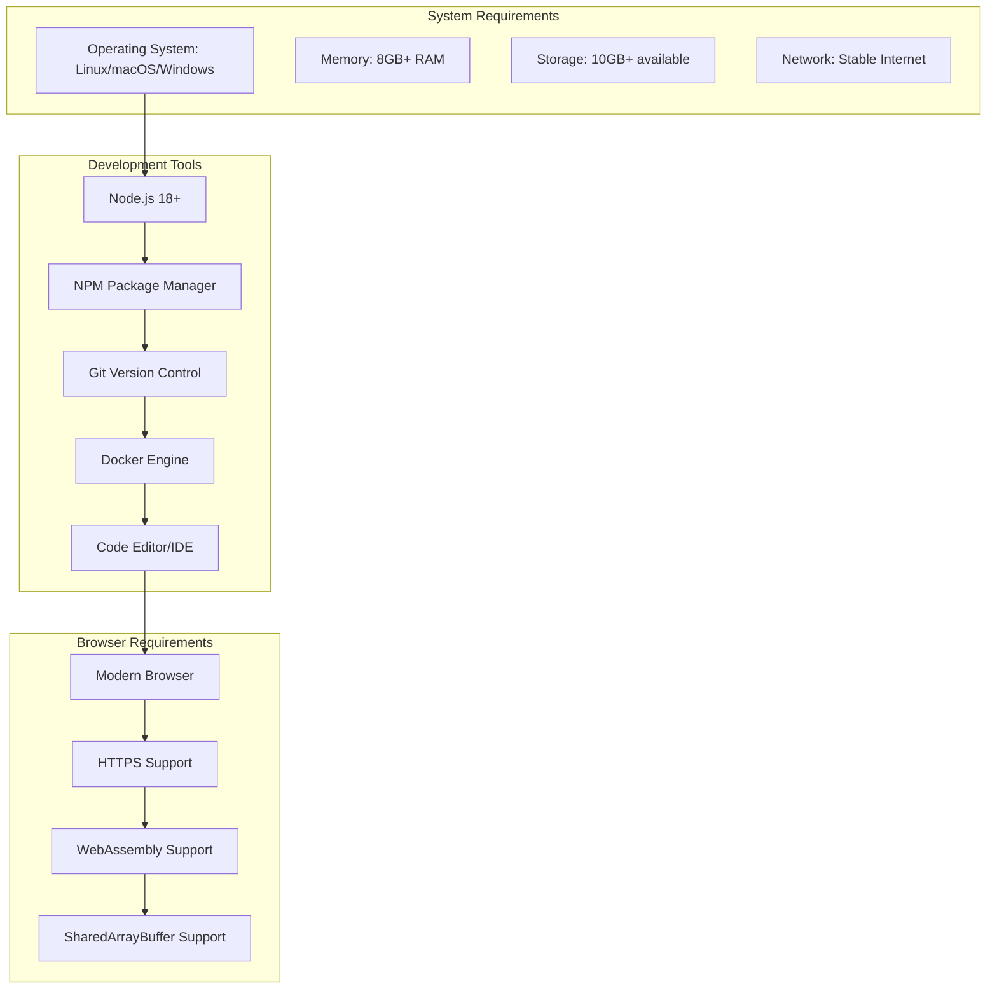
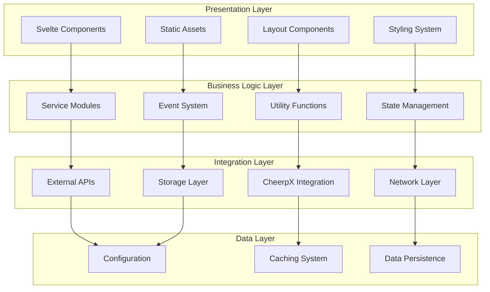
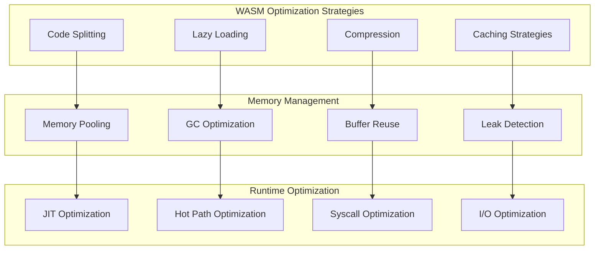

# WebVM Development Guide

This guide provides comprehensive information for developers working on WebVM, including setup, architecture patterns, and contribution guidelines.

## Development Environment Setup

### Prerequisites



### Quick Start

```bash
# Clone the repository
git clone https://github.com/leaningtech/webvm.git
cd webvm

# Install dependencies
npm install

# Start development server
npm run dev

# Build for production
npm run build
```

### Development Server Configuration

The development server uses Vite with custom configuration for WebVM-specific needs.

```javascript
// vite.config.js
import { defineConfig } from 'vite';
import { svelte } from '@sveltejs/vite-plugin-svelte';
import { viteStaticCopy } from 'vite-plugin-static-copy';

export default defineConfig({
    plugins: [
        svelte(),
        viteStaticCopy({
            targets: [
                {
                    src: 'node_modules/@leaningtech/cheerpx/cx.js',
                    dest: ''
                }
            ]
        })
    ],
    server: {
        headers: {
            'Cross-Origin-Opener-Policy': 'same-origin',
            'Cross-Origin-Embedder-Policy': 'require-corp'
        },
        https: true // Required for WebAssembly features
    }
});
```

## Architecture Patterns

### Component Structure

WebVM follows a modular component architecture with clear separation of concerns.



### File Organization

```
src/
├── lib/                    # Reusable components and utilities
│   ├── components/         # UI components
│   │   ├── AnthropicTab.svelte
│   │   ├── SideBar.svelte
│   │   └── WebVM.svelte
│   ├── services/          # Business logic services
│   │   ├── anthropic.js
│   │   ├── network.js
│   │   └── activities.js
│   ├── utils/             # Utility functions
│   │   ├── messages.js
│   │   └── plausible.js
│   └── styles/            # Global styles
│       └── global.css
├── routes/                # SvelteKit routes
│   ├── +layout.svelte
│   ├── +page.svelte
│   └── alpine/
│       ├── +page.svelte
│       └── +page.js
└── app.html              # HTML template
```

### Component Development Patterns

#### 1. Component Props and Events

```svelte
<!-- Example: ActivityIndicator.svelte -->
<script>
    import { createEventDispatcher } from 'svelte';
    
    export let activity = 0;
    export let threshold = 50;
    export let color = 'blue';
    
    const dispatch = createEventDispatcher();
    
    $: isActive = activity > threshold;
    
    function handleClick() {
        dispatch('activity-click', {
            activity,
            timestamp: Date.now()
        });
    }
</script>

<div 
    class="indicator {color}" 
    class:active={isActive}
    on:click={handleClick}
>
    Activity: {activity}%
</div>

<style>
    .indicator {
        padding: 0.5rem;
        border-radius: 0.25rem;
        transition: all 0.3s ease;
    }
    
    .indicator.active {
        transform: scale(1.05);
        box-shadow: 0 0 10px currentColor;
    }
</style>
```

#### 2. Service Integration Pattern

```javascript
// services/systemMonitor.js
import { writable } from 'svelte/store';

class SystemMonitor {
    constructor() {
        this.cpuUsage = writable(0);
        this.memoryUsage = writable(0);
        this.diskIO = writable(0);
        
        this.startMonitoring();
    }
    
    startMonitoring() {
        setInterval(() => {
            this.updateMetrics();
        }, 1000);
    }
    
    updateMetrics() {
        // Collect system metrics
        const cpu = this.getCurrentCPUUsage();
        const memory = this.getCurrentMemoryUsage();
        const disk = this.getCurrentDiskIO();
        
        this.cpuUsage.set(cpu);
        this.memoryUsage.set(memory);
        this.diskIO.set(disk);
    }
    
    getCurrentCPUUsage() {
        // Implementation for CPU usage monitoring
        return Math.random() * 100; // Placeholder
    }
    
    getCurrentMemoryUsage() {
        // Implementation for memory usage monitoring
        return performance.memory?.usedJSHeapSize || 0;
    }
    
    getCurrentDiskIO() {
        // Implementation for disk I/O monitoring
        return Math.random() * 1000; // Placeholder
    }
}

export const systemMonitor = new SystemMonitor();
```

#### 3. Configuration Management Pattern

```javascript
// services/config.js
class ConfigManager {
    constructor() {
        this.config = {};
        this.subscribers = new Set();
    }
    
    async loadConfig(configPath) {
        try {
            const module = await import(configPath);
            this.config = {
                diskImageUrl: module.diskImageUrl,
                diskImageType: module.diskImageType,
                cmd: module.cmd,
                args: module.args,
                opts: module.opts
            };
            
            this.notifySubscribers();
        } catch (error) {
            console.error('Failed to load config:', error);
            throw error;
        }
    }
    
    subscribe(callback) {
        this.subscribers.add(callback);
        return () => this.subscribers.delete(callback);
    }
    
    notifySubscribers() {
        this.subscribers.forEach(callback => callback(this.config));
    }
    
    get(key, defaultValue = null) {
        return this.config[key] ?? defaultValue;
    }
    
    set(key, value) {
        this.config[key] = value;
        this.notifySubscribers();
    }
}

export const configManager = new ConfigManager();
```

## Testing Strategies

### Unit Testing

WebVM uses Vitest for unit testing with custom matchers for WebAssembly-specific functionality.

```javascript
// tests/services/config.test.js
import { describe, it, expect, beforeEach } from 'vitest';
import { configManager } from '../src/lib/services/config.js';

describe('ConfigManager', () => {
    beforeEach(() => {
        configManager.config = {};
    });
    
    it('should load configuration correctly', async () => {
        const mockConfig = {
            diskImageUrl: 'test://disk.ext2',
            diskImageType: 'cloud',
            cmd: '/bin/bash'
        };
        
        // Mock dynamic import
        vi.mock('./test-config.js', () => mockConfig);
        
        await configManager.loadConfig('./test-config.js');
        
        expect(configManager.get('diskImageUrl')).toBe('test://disk.ext2');
        expect(configManager.get('diskImageType')).toBe('cloud');
        expect(configManager.get('cmd')).toBe('/bin/bash');
    });
    
    it('should handle configuration errors', async () => {
        await expect(
            configManager.loadConfig('./non-existent-config.js')
        ).rejects.toThrow();
    });
});
```

### Integration Testing

Integration tests verify component interactions and WebAssembly functionality.

```javascript
// tests/integration/webvm.test.js
import { render, fireEvent, waitFor } from '@testing-library/svelte';
import { describe, it, expect } from 'vitest';
import WebVM from '../src/lib/WebVM.svelte';

describe('WebVM Integration', () => {
    it('should initialize WebVM correctly', async () => {
        const config = {
            diskImageUrl: 'test://disk.ext2',
            diskImageType: 'bytes',
            cmd: '/bin/bash',
            args: ['--login']
        };
        
        const { container } = render(WebVM, { configObj: config });
        
        // Wait for initialization
        await waitFor(() => {
            const terminal = container.querySelector('.xterm');
            expect(terminal).toBeInTheDocument();
        }, { timeout: 10000 });
    });
    
    it('should handle terminal input', async () => {
        const config = { /* test config */ };
        const { container } = render(WebVM, { configObj: config });
        
        const terminal = await waitFor(() => 
            container.querySelector('.xterm-helper-textarea')
        );
        
        // Simulate user input
        await fireEvent.input(terminal, { 
            target: { value: 'echo "Hello World"' } 
        });
        
        await fireEvent.keyDown(terminal, { key: 'Enter' });
        
        // Verify output (implementation depends on test environment)
        // This would require mocking CheerpX
    });
});
```

### End-to-End Testing

E2E tests use Playwright to test complete user workflows.

```javascript
// tests/e2e/webvm.spec.js
import { test, expect } from '@playwright/test';

test.describe('WebVM E2E', () => {
    test('should load and initialize WebVM', async ({ page }) => {
        await page.goto('http://localhost:5173');
        
        // Wait for WebVM to load
        await expect(page.locator('.terminal')).toBeVisible();
        
        // Check for terminal prompt
        await expect(page.locator('.xterm-rows')).toContainText('user@');
    });
    
    test('should execute commands', async ({ page }) => {
        await page.goto('http://localhost:5173');
        await page.waitForSelector('.terminal');
        
        // Type command
        await page.keyboard.type('echo "Hello, WebVM!"');
        await page.keyboard.press('Enter');
        
        // Wait for output
        await expect(page.locator('.xterm-rows')).toContainText('Hello, WebVM!');
    });
    
    test('should open and use sidebar', async ({ page }) => {
        await page.goto('http://localhost:5173');
        
        // Click on CPU monitor icon
        await page.click('[data-testid="cpu-monitor"]');
        
        // Verify sidebar opens
        await expect(page.locator('.sidebar-panel')).toBeVisible();
        
        // Check CPU metrics are displayed
        await expect(page.locator('.cpu-usage')).toBeVisible();
    });
});
```

## Performance Optimization

### WebAssembly Optimization



### Performance Monitoring Implementation

```javascript
// utils/performance.js
class PerformanceMonitor {
    constructor() {
        this.metrics = new Map();
        this.observers = new Map();
    }
    
    startTiming(name) {
        this.metrics.set(name, {
            start: performance.now(),
            end: null,
            duration: null
        });
    }
    
    endTiming(name) {
        const metric = this.metrics.get(name);
        if (metric) {
            metric.end = performance.now();
            metric.duration = metric.end - metric.start;
            
            this.notifyObservers(name, metric);
        }
    }
    
    measureFunction(fn, name) {
        return async (...args) => {
            this.startTiming(name);
            try {
                const result = await fn(...args);
                this.endTiming(name);
                return result;
            } catch (error) {
                this.endTiming(name);
                throw error;
            }
        };
    }
    
    observePerformance(name, callback) {
        if (!this.observers.has(name)) {
            this.observers.set(name, new Set());
        }
        this.observers.get(name).add(callback);
    }
    
    notifyObservers(name, metric) {
        const observers = this.observers.get(name);
        if (observers) {
            observers.forEach(callback => callback(metric));
        }
    }
}

export const performanceMonitor = new PerformanceMonitor();
```

## Debugging Tools and Techniques

### WebVM Debug Console

```javascript
// utils/debug.js
class WebVMDebugger {
    constructor() {
        this.enabled = process.env.NODE_ENV === 'development';
        this.logs = [];
        this.maxLogs = 1000;
    }
    
    log(level, message, data = {}) {
        if (!this.enabled) return;
        
        const logEntry = {
            timestamp: new Date().toISOString(),
            level,
            message,
            data,
            stack: new Error().stack
        };
        
        this.logs.push(logEntry);
        if (this.logs.length > this.maxLogs) {
            this.logs.shift();
        }
        
        console[level](message, data);
    }
    
    info(message, data) {
        this.log('info', message, data);
    }
    
    warn(message, data) {
        this.log('warn', message, data);
    }
    
    error(message, data) {
        this.log('error', message, data);
    }
    
    getLogs(level = null) {
        return level 
            ? this.logs.filter(log => log.level === level)
            : this.logs;
    }
    
    clearLogs() {
        this.logs = [];
    }
}

export const debugger = new WebVMDebugger();
```

### CheerpX Integration Debugging

```javascript
// utils/cheerpx-debug.js
export class CheerpXDebugger {
    constructor(cx) {
        this.cx = cx;
        this.syscallCounts = new Map();
        this.performanceMetrics = new Map();
    }
    
    wrapSystemCalls() {
        const originalSyscall = this.cx.syscall;
        
        this.cx.syscall = (syscallNum, ...args) => {
            const start = performance.now();
            const syscallName = this.getSyscallName(syscallNum);
            
            // Count syscall usage
            const count = this.syscallCounts.get(syscallName) || 0;
            this.syscallCounts.set(syscallName, count + 1);
            
            // Execute syscall
            const result = originalSyscall.call(this.cx, syscallNum, ...args);
            
            // Record performance
            const duration = performance.now() - start;
            if (!this.performanceMetrics.has(syscallName)) {
                this.performanceMetrics.set(syscallName, []);
            }
            this.performanceMetrics.get(syscallName).push(duration);
            
            return result;
        };
    }
    
    getSyscallName(syscallNum) {
        const syscalls = {
            0: 'read',
            1: 'write',
            2: 'open',
            3: 'close',
            // ... more syscalls
        };
        return syscalls[syscallNum] || `syscall_${syscallNum}`;
    }
    
    getStats() {
        const stats = {};
        
        for (const [syscall, count] of this.syscallCounts.entries()) {
            const times = this.performanceMetrics.get(syscall) || [];
            const avgTime = times.reduce((a, b) => a + b, 0) / times.length;
            
            stats[syscall] = {
                count,
                averageTime: avgTime,
                totalTime: times.reduce((a, b) => a + b, 0)
            };
        }
        
        return stats;
    }
}
```

## Contribution Guidelines

### Code Style and Standards

WebVM follows strict code style guidelines to maintain consistency and readability.

```javascript
// .eslintrc.js
module.exports = {
    extends: [
        '@sveltejs/eslint-config-svelte',
        'eslint:recommended'
    ],
    rules: {
        'indent': ['error', 4],
        'quotes': ['error', 'single'],
        'semi': ['error', 'always'],
        'no-console': 'warn',
        'no-debugger': 'error',
        'prefer-const': 'error',
        'no-var': 'error'
    },
    parserOptions: {
        ecmaVersion: 2022,
        sourceType: 'module'
    }
};
```

### Git Workflow

```mermaid
graph LR
    subgraph "Feature Development"
        Feature[Feature Branch]
        Commits[Feature Commits]
        Tests[Add Tests]
        Review[Code Review]
    end
    
    subgraph "Integration"
        PR[Pull Request]
        CI[CI Checks]
        Approval[Review Approval]
        Merge[Merge to Main]
    end
    
    subgraph "Release"
        Tag[Version Tag]
        Release[GitHub Release]
        Deploy[Deploy to Production]
        Monitor[Monitor Deployment]
    end
    
    Feature --> Commits
    Commits --> Tests
    Tests --> Review
    Review --> PR
    PR --> CI
    CI --> Approval
    Approval --> Merge
    Merge --> Tag
    Tag --> Release
    Release --> Deploy
    Deploy --> Monitor
```

### Pull Request Template

```markdown
## Description
Brief description of changes

## Type of Change
- [ ] Bug fix (non-breaking change which fixes an issue)
- [ ] New feature (non-breaking change which adds functionality)
- [ ] Breaking change (fix or feature that would cause existing functionality to not work as expected)
- [ ] Documentation update

## Testing
- [ ] Unit tests pass
- [ ] Integration tests pass
- [ ] E2E tests pass
- [ ] Manual testing completed

## Checklist
- [ ] Code follows style guidelines
- [ ] Self-review completed
- [ ] Comments added for complex logic
- [ ] Documentation updated
- [ ] No breaking changes or migration guide provided
```

This development guide provides a comprehensive foundation for contributing to and extending WebVM while maintaining code quality and consistency.