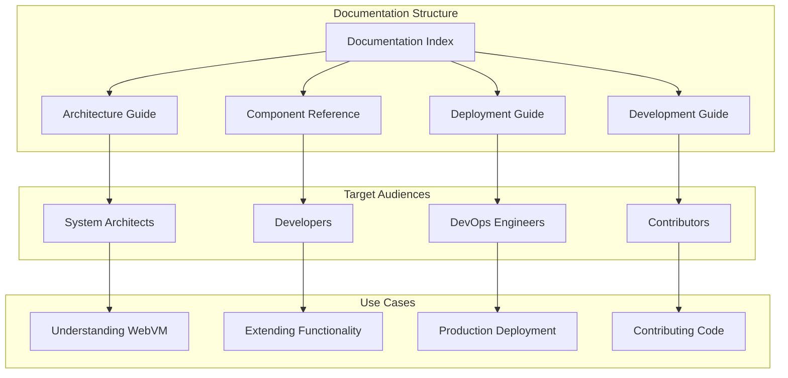
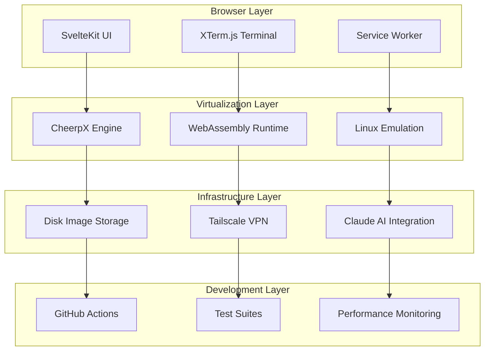

# WebVM Documentation Index

Welcome to the comprehensive technical documentation for WebVM - a revolutionary browser-based Linux virtual machine powered by CheerpX virtualization technology.

## 📚 Documentation Overview

This documentation suite provides detailed technical information about WebVM's architecture, components, deployment strategies, and development practices. Each document is designed to serve different audiences and use cases.

## 📖 Document Guide

### [ARCHITECTURE.md](./ARCHITECTURE.md) - Technical Architecture Overview

**Target Audience**: System architects, technical leads, and anyone seeking to understand WebVM's overall design

**Contents**:
- High-level system architecture with mermaid diagrams
- Core component relationships and interactions
- Data flow and communication patterns
- Networking architecture with Tailscale integration
- File system and virtualization layers
- Security and sandboxing model
- Technology stack overview
- Performance characteristics and limitations

**When to read**: Start here to gain a comprehensive understanding of how WebVM works at a system level.

### [COMPONENTS.md](./COMPONENTS.md) - Component Reference

**Target Audience**: Developers working with WebVM components, frontend engineers, and contributors

**Contents**:
- Detailed breakdown of WebVM's core components
- WebVM.svelte main application component
- SideBar.svelte control panel interface  
- Terminal integration with XTerm.js
- Activity monitoring system
- Configuration management
- Network integration patterns
- AI integration architecture
- File system implementation details

**When to read**: Reference this when developing new features, debugging components, or understanding specific implementation details.

### [DEPLOYMENT.md](./DEPLOYMENT.md) - Deployment Guide

**Target Audience**: DevOps engineers, system administrators, and deployment specialists

**Contents**:
- Complete deployment architecture overview
- GitHub Actions CI/CD pipeline configuration
- Local development deployment setup
- Production deployment strategies (GitHub Pages, self-hosted)
- Container deployment with Docker and Kubernetes
- Security considerations and requirements
- Monitoring and observability setup
- Troubleshooting common deployment issues

**When to read**: Essential for anyone deploying WebVM in any environment, from local development to production.

### [DEVELOPMENT.md](./DEVELOPMENT.md) - Development Guide

**Target Audience**: Contributors, developers extending WebVM, and maintainers

**Contents**:
- Development environment setup
- Architecture patterns and best practices
- Component development guidelines
- Testing strategies (unit, integration, E2E)
- Performance optimization techniques
- Debugging tools and methodologies
- Code style and contribution guidelines
- Git workflow and pull request process

**When to read**: Required reading for anyone contributing code to WebVM or building extensions.

## 🚀 Quick Start Paths

### I want to understand WebVM's architecture
1. Read [ARCHITECTURE.md](./ARCHITECTURE.md) - Start with the high-level overview
2. Review [COMPONENTS.md](./COMPONENTS.md) - Dive into specific components of interest
3. Check [DEVELOPMENT.md](./DEVELOPMENT.md) - Understand the development patterns

### I want to deploy WebVM
1. Read [DEPLOYMENT.md](./DEPLOYMENT.md) - Comprehensive deployment guide
2. Review [ARCHITECTURE.md](./ARCHITECTURE.md) - Understand security and infrastructure requirements
3. Reference [COMPONENTS.md](./COMPONENTS.md) - For configuration and customization

### I want to contribute to WebVM
1. Start with [DEVELOPMENT.md](./DEVELOPMENT.md) - Setup and contribution guidelines
2. Review [ARCHITECTURE.md](./ARCHITECTURE.md) - Understand the overall system
3. Use [COMPONENTS.md](./COMPONENTS.md) - As a reference while developing

### I want to customize WebVM
1. Read [COMPONENTS.md](./COMPONENTS.md) - Understand component structure
2. Review [DEVELOPMENT.md](./DEVELOPMENT.md) - Learn development patterns
3. Reference [DEPLOYMENT.md](./DEPLOYMENT.md) - For custom deployment strategies

## 🔧 Key Technologies

WebVM leverages several cutting-edge technologies:

| Technology | Purpose | Documentation Section |
|------------|---------|----------------------|
| **CheerpX** | x86-to-WebAssembly virtualization | [ARCHITECTURE.md](./ARCHITECTURE.md#virtualization--runtime) |
| **SvelteKit** | Modern web application framework | [COMPONENTS.md](./COMPONENTS.md#webvmsvelte---main-application-component) |
| **XTerm.js** | Terminal emulator for web browsers | [COMPONENTS.md](./COMPONENTS.md#terminal-integration-xtermjs) |
| **Tailscale** | VPN networking solution | [ARCHITECTURE.md](./ARCHITECTURE.md#networking-architecture) |
| **WebAssembly** | High-performance runtime | [DEVELOPMENT.md](./DEVELOPMENT.md#webassembly-optimization) |
| **Docker** | Container platform for disk images | [DEPLOYMENT.md](./DEPLOYMENT.md#container-deployment) |
| **GitHub Actions** | CI/CD automation | [DEPLOYMENT.md](./DEPLOYMENT.md#github-actions-cicd-pipeline) |

## 📊 Architecture At-a-Glance

## 🎯 Common Use Cases

### Educational and Learning
- Programming tutorials and workshops
- Computer science education
- Safe environment for learning system administration
- Demonstration of Linux concepts

### Development and Testing
- Quick access to Linux development environment
- Testing applications in isolated environment
- Cross-platform development
- CI/CD pipeline testing

### Research and Experimentation
- WebAssembly virtualization research
- Browser technology demonstrations
- Academic computer science projects
- Security research in sandboxed environments

### Business and Enterprise
- Browser-based development environments
- Customer demonstrations and onboarding
- Training and certification platforms
- Zero-installation software delivery

## 📚 Additional Resources

### External Documentation
- [CheerpX Documentation](https://cheerpx.io/docs/) - Comprehensive CheerpX virtualization engine documentation
- [SvelteKit Documentation](https://kit.svelte.dev/) - SvelteKit framework documentation
- [XTerm.js Documentation](https://xtermjs.org/) - Terminal emulator documentation
- [Tailscale Documentation](https://tailscale.com/kb/) - VPN networking documentation

### Community and Support
- [GitHub Repository](https://github.com/leaningtech/webvm) - Source code and issue tracking
- [Discord Community](https://discord.gg/yTNZgySKGa) - Community discussions and support
- [Blog Posts](https://leaningtech.com/webvm-server-less-x86-virtual-machines-in-the-browser/) - Technical articles and announcements

### Related Projects
- [CheerpX](https://cheerpx.io/) - x86 virtualization engine
- [Cheerp](https://github.com/leaningtech/cheerp-meta/) - C++ to WebAssembly compiler
- [lwIP](https://savannah.nongnu.org/projects/lwip/) - Lightweight TCP/IP stack

## 🤝 Contributing to Documentation

We welcome contributions to improve this documentation. Please follow these guidelines:

1. **Accuracy**: Ensure all technical information is current and accurate
2. **Clarity**: Write clearly and concisely for the target audience
3. **Completeness**: Include relevant mermaid diagrams and code examples
4. **Consistency**: Follow the established documentation structure and style
5. **Testing**: Verify that all examples and instructions work correctly

### Documentation Structure Guidelines

- Use mermaid diagrams to illustrate complex concepts
- Include code examples where helpful
- Provide clear section headers and navigation
- Target specific audiences for each document
- Cross-reference related sections appropriately

## 📝 Documentation Versioning

This documentation is versioned alongside the WebVM codebase:

- **Version 2.x**: Current documentation for WebVM 2.0+
- **Updates**: Documentation is updated with each major release
- **Backwards Compatibility**: Migration guides provided for breaking changes

---

*This documentation suite provides comprehensive coverage of WebVM's architecture, deployment, and development processes. Choose the appropriate guide based on your role and objectives, and don't hesitate to contribute improvements or ask questions through the community channels.*